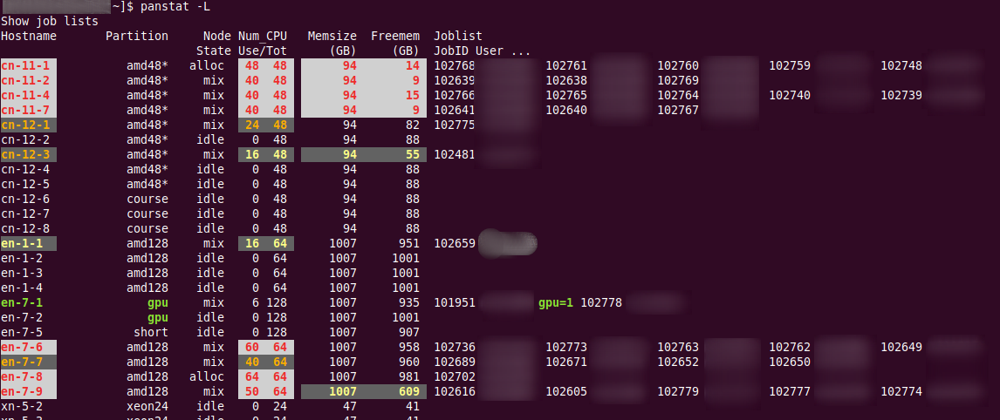

The Slurm tool "panstat" (Panthera status)
--------------------------------------------------

Print Slurm nodes status with 1 line per node including job info.

**panstat** is a modified version of **pestat** written by [Ole Holm Nielsen](https://github.com/OleHolmNielsen/Slurm_tools), with focus on users' view of the cluster. In pestat, the focus is on the admin view of the cluster.

Usage
-----

```
Usage: panstat [-p partition(s)] [-P] [-u username] [-g groupname] [-A accountname] [-a]
	[-q qoslist] [-s/-t statelist] [-n/-w hostlist] [-j joblist] [-G] [-N]
	[-f | -F | -m free_mem | -M free_mem ] [-1|-2] [-d] [-S] [-E] [-T] [-C|-c] [-h]
where:
	-p partition: Select only partion <partition>
        -P: Include all partitions, including hidden and unavailable ones
	-u username: Print only jobs of a single user <username> 
	-g groupname: Print only users in UNIX group <groupname>
	-A accountname: Print only jobs in Slurm account <accountname>
	-a: Print User(Account) information after each JobID
	-q qoslist: Print only QOS in the qoslist <qoslist>
	-R reservationlist: Print only node reservations <reservationlist>
	-s|-t statelist: Print only nodes with state in <statelist> 
	-n|-w hostlist: Print only nodes in hostlist
	-j joblist: Print only nodes in job <joblist>
	-G: Print GRES (Generic Resources) in addition to JobID
	-N: Print JobName in addition to JobID
	-f: Print only nodes that are flagged by * (unexpected load etc.)
	-F: Like -f, but only nodes flagged in RED are printed.
	-m free_mem: Print only nodes with free memory LESS than free_mem GB
	-M free_mem: Print only nodes with free memory GREATER than free_mem GB (under-utilized)
	-d: Omit nodes with states: down drain drng resv maint boot
	-1: Default: Only 1 line per node (unique nodes in multiple partitions are printed once only)
	-2: 2..N lines per node which participates in multiple partitions 
	-S: Job StartTime is printed after each JobID/user
	-E: Job EndTime is printed after each JobID/user
	-T: Job TimeUsed is printed after each JobID/user
	-C: Color output is forced ON
	-c: Color output is forced OFF
	-h: Print this help information
```

Notice: This version of panstat uses ```squeue -O``` flags to list jobs, and this may not work correctly for Slurm 19.05 and older.

Example output
--------------



If there are any running array jobs, the JobID column will be shown as ```JobID(JobArrayID)```.
If a JobID is a member of a job array, the (JobArrayID) is shown after JobID.

Installation
------------

Copy panstat to a directory in the PATH:

```
wget https://raw.githubusercontent.com/smhr/slurm-tools/refs/heads/main/panstat
chmod 755 panstat
cp panstat /usr/local/bin
```

If installing as a normal user, copy to the ~/bin for example:

```
cp panstat ~/bin
```

If desired copy panstat.conf:

```
wget https://raw.githubusercontent.com/smhr/slurm-tools/refs/heads/main/panstat.conf
cp panstat.conf /etc/
```

Edit panstat.conf according to your needs.
Users may copy and edit this file as ```$HOME/.panstat.conf```.

Configuration
-------------

Some Environment configuration lines lines near the top of panstat may need to be changed for your environment, for example:

```
# Directory where Slurm commands live:
export prefix=/usr/bin
```

The global configuration file for panstat: ```/etc/panstat.conf```

Per-user configuration file for panstat: ```$HOME/.panstat.conf```

It is strongly recommended that you do not change the panstat script itself,
but make changes only in the above mentioned configuration files for panstat
to suit your needs.

Please write to the author if additional configurations should be made possible.

History
-------

The pestat tool was inspired by a similar tool for Torque/PBS by David Singleton (Sep 23, 2004),
see https://github.com/abarbu/torque/blob/master/contrib/README.pestat

The present author later (in 2007) wrote a pestat bash script for Torque, see https://github.com/OleHolmNielsen/Torque_tools

